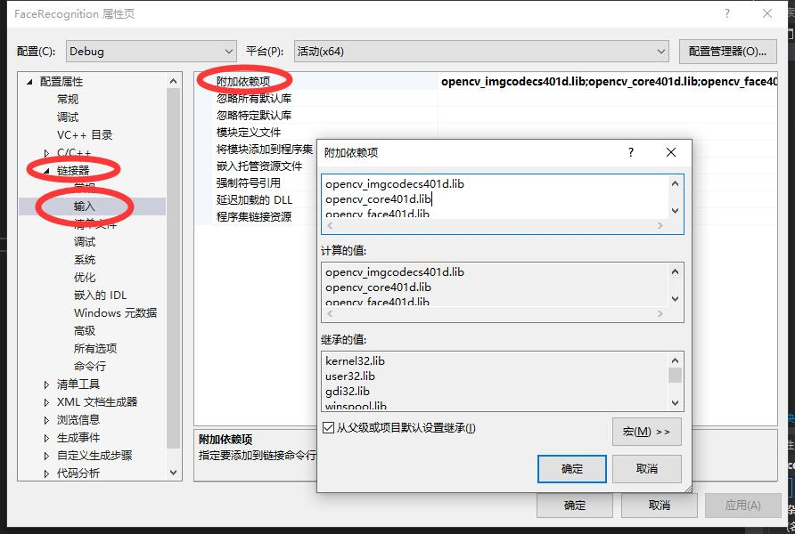
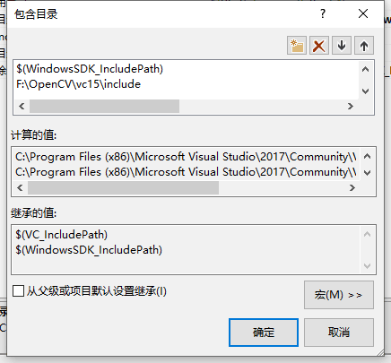
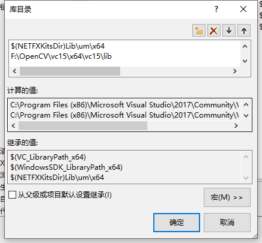

# FaceDetection
### Compile Platform
**我们在vs2017中实现了人脸识别，他需要配置一些opencv的库，具体配置过程如下**
#### 手动加入的Libs

* opencv_imgcodecs401d.lib
* opencv_core401d.lib
* opencv_face401d.lib
* opencv_imgproc401d.lib
* opencv_objdetect401d.lib
#### 再添加opencv库目录

### 训练，识别过程
* 在trainData目录下，有几位上课的同学就建几个文件夹，命名规则：1,2,3，etc。每个文件夹中放置四张照片。在namelist.txt依据文件夹顺序写上姓名
* 确保有下图蓝标的文件

* 在该目录下，右键打开PowerShell输入以下命令：FaceDetection.exe -1，会训练出一个模型，如下图所示

* 此时在当前目录下，放置上课同学的照片，合照，单张照都可以，原理上是以脸（一个Mat）进行识别的。照片命名规则：1.jpg,2.jpg,3.jpg,etc
* 依旧是右键，PowerShell，输入：FaceDetection.exe n，有n张待识别照片
* 识别结果会写入result.txt，名字并没有先后顺序
#### 结果展示
